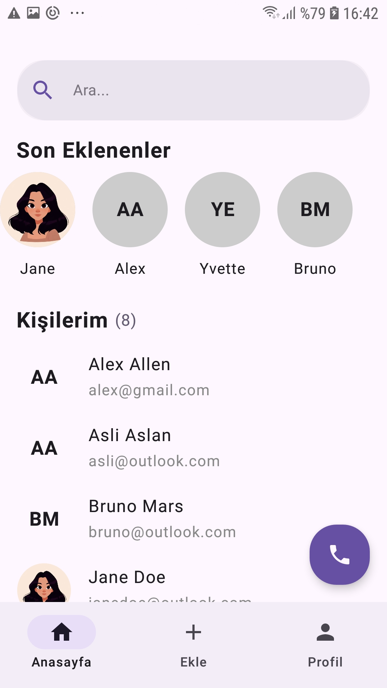
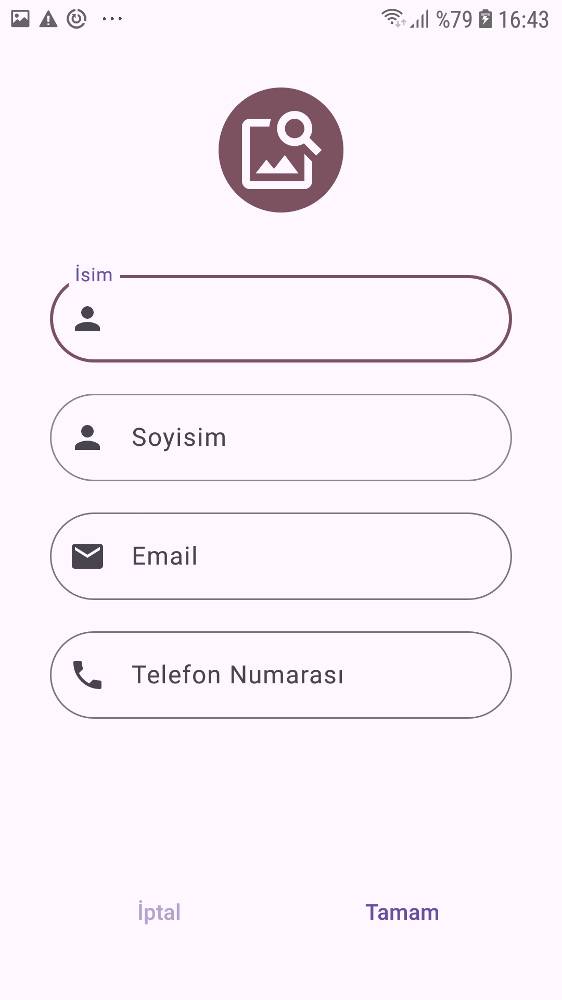
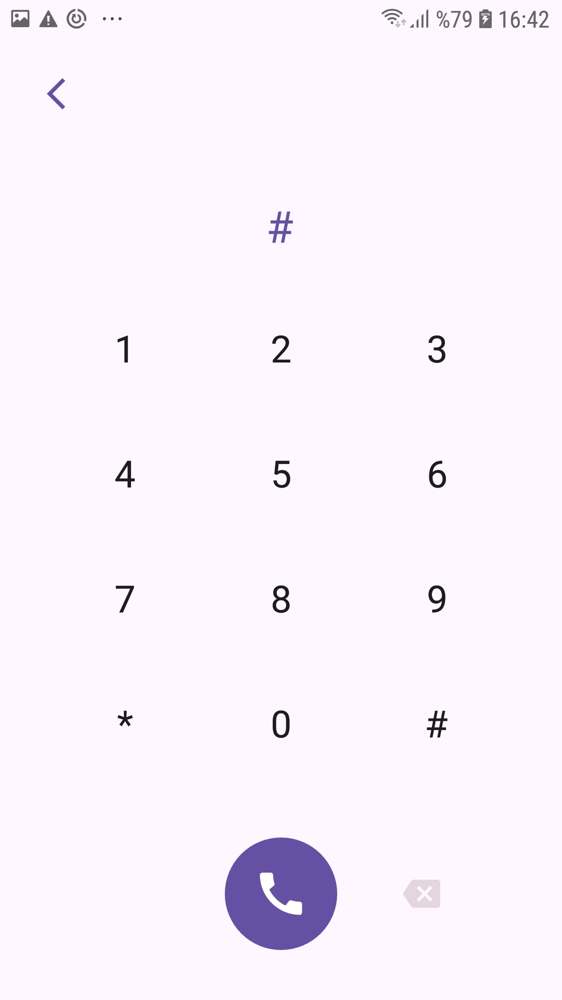
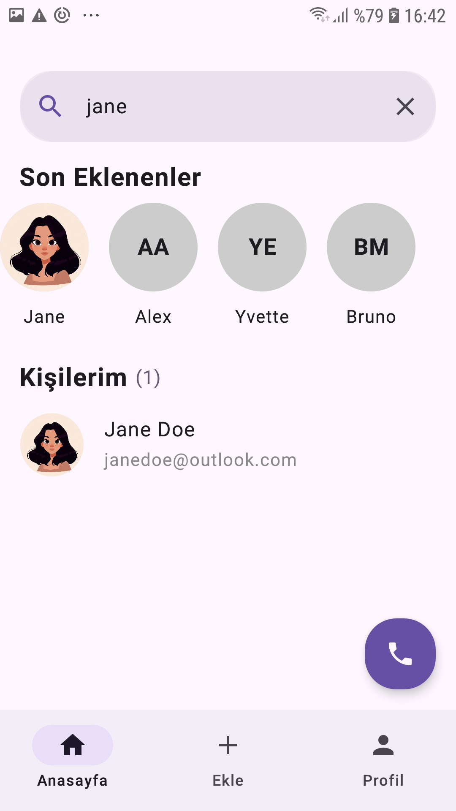
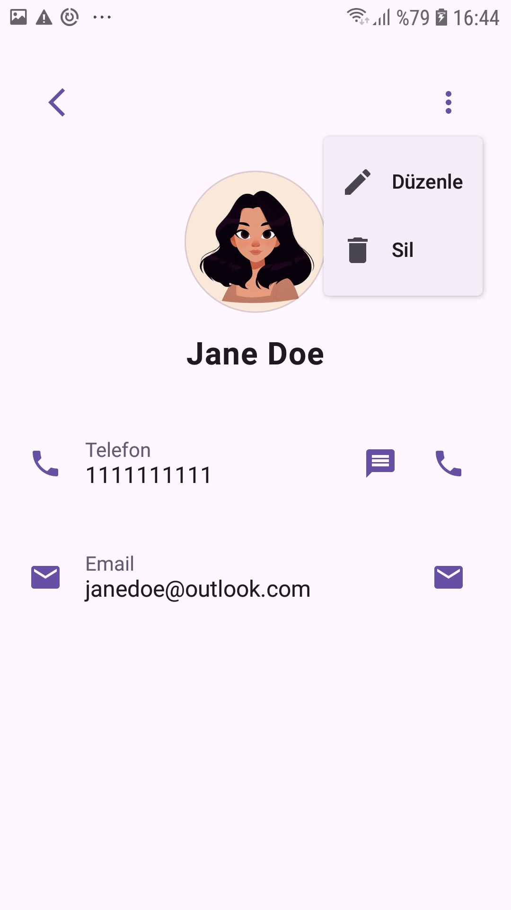
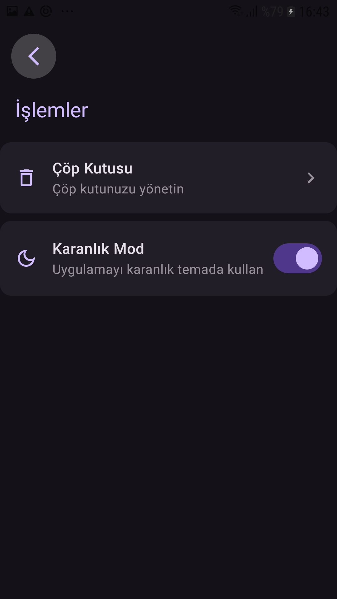

# Contact App 📱

A modern contact management application built with Jetpack Compose, following Clean Architecture principles and MVVM design pattern. The app provides a comprehensive contact management experience with features like image storage, search functionality, and a trash system.

## ✨ Features

- **Contact Management**: Add, edit, view, and delete contacts
- **Image Storage**: Save and display contact profile pictures
- **Search Functionality**: Search through contacts by name or phone number
- **Communication Integration**: Direct integration with phone, SMS, and email apps
- **Trash System**: Soft delete with restore functionality
- **Dark Mode**: Theme switching with DataStore persistence
- **Modern UI**: Material 3 Design System implementation

## 📸 Screenshots

<table>
  <tr>
    <td></td>
     <td></td>
    <td></td>
  </tr>
  <tr>
    <td></td>
    <td></td>
  </tr>
   <tr>
    <td></td>
    <td></td>
  </tr>
</table>

## 🏗️ Architecture

The app follows **Clean Architecture** principles with **MVVM** (Model-View-ViewModel) pattern.
## 🛠️ Technologies Used

### Core Technologies
- **Jetpack Compose** - Modern Android UI toolkit
- **Kotlin** - Primary programming language
- **Coroutines & Flow** - Asynchronous programming

### Architecture Components
- **MVVM Pattern** - Architectural design pattern
- **ViewModel** - UI-related data holder, lifecycle conscious
- **Clean Architecture** - Separation of concerns
- **Repository Pattern** - Data access abstraction
- **Use Cases** - Business logic encapsulation

### Database & Storage
- **Room Database** - Local SQLite database abstraction
- **DataStore** - Modern data storage solution for preferences

### Dependency Injection
- **Dagger Hilt** - Dependency injection framework

### UI & Design
- **Material 3 Design** - Google's latest design system
- **Compose Navigation** - Navigation component for Compose

### Key Features Implementation
- **Image Handling** - Contact profile picture storage and display
- **Search System** - Real-time contact search functionality
- **Soft Delete System** - Trash/restore functionality
- **Dark Mode** - Theme persistence with DataStore
- **External App Integration** - Phone, SMS, and Email intents

> Built with ❤️ using modern Android technologies.
